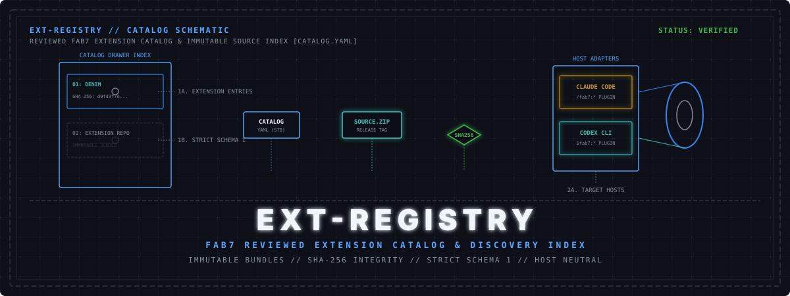

<p align="center">
  
</p>

# Fab7 Extension Registry

The reviewed extension catalog for the [Fab7](https://github.com/fab7hq/fab7) ecosystem. Contains metadata only (`catalog.yaml`)—no extension source code, executables, host plugins, or runtime artifacts.

Fab7 consumes this catalog to discover extension releases, verify SHA-256 source digests, and build native executables for target CLI hosts.

---

## Schema 1

[`catalog.yaml`](catalog.yaml) uses JSON-compatible YAML (Schema 1) parsed using Python's standard library:

```yaml
{
  "schema": 1,
  "registry": "fab7hq/ext-registry",
  "catalog_version": "0.1.0",
  "extensions": [
    {
      "name": "denim",
      "publisher": "fab7hq",
      "version": "0.1.0",
      "fab7_api": 1,
      "hosts": ["claude", "codex"],
      "source": {
        "url": "https://github.com/fab7hq/denim/releases/download/v0.1.0/denim-0.1.0.source.zip",
        "sha256": "sha256:d9f43f7e9ccf47f14626c9f1cc67062310ac5169812cadf95b9645627a0cc026"
      }
    }
  ]
}
```

---

## Usage

```bash
# Refresh catalog & list extensions
fab7 ext refresh
fab7 ext list

# Install an extension
fab7 ext install denim --host claude

# Test catalog.yaml locally
uv run --project ../fab7 fab7 ext list --catalog catalog.yaml --json
```

---

## Rules

- **Canonical Sorting**: Extensions are listed alphabetically by `name`.
- **Immutable Source Bundles**: Requires tagged release ZIPs and SHA-256 digests. Moving branches or `latest` URLs are rejected.
- **Version Bumping**: Increment `catalog_version` whenever catalog bytes change.
- **Discovery Only**: Catalog inclusion provides discovery metadata, not execution authority.

## Contributing and support

- Propose a catalog entry or report a catalog defect with the focused [issue forms](https://github.com/fab7hq/ext-registry/issues/new/choose).
- Read [CONTRIBUTING.md](CONTRIBUTING.md) before submitting a pull request.
- Ask ecosystem questions in [Fab7 Discussions](https://github.com/fab7hq/fab7/discussions).
- Report vulnerabilities privately through the process in [SECURITY.md](SECURITY.md).

## License

Licensed under the [Apache License 2.0](LICENSE).
